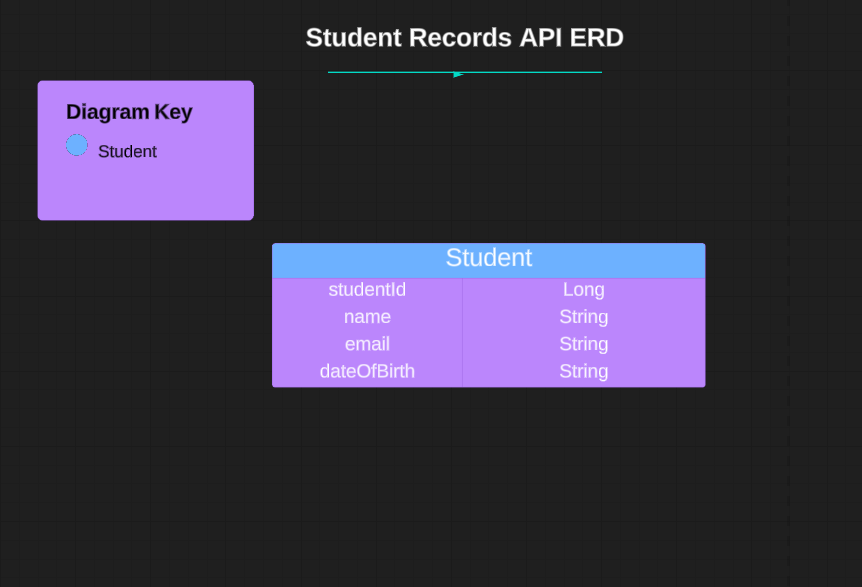

# Student Records API 

This project aims to create a user-friendly and intuitive student API that interacts with the front end to perform CRUD operations on student records. The API is designed to cater initially to administrators, providing appropriate functionality and views for this role. For the backend, I have developed an API that handles the CRUD (Create, Read, Update, Delete) operations for managing students. Each of the endpoints follows RESTful principles and accepts appropriate HTTP methods (POST, GET, PUT, DELETE). Responses are in JSON format to ensure compatibility and ease of integration with frontend applications. 


## Technologies Used

* Java 20 
* Maven
* Spring Boot
* Spring Data (JPA)
* H2 Database
* Postman 
* Apache Tomcat 
* IntelliJ


## Getting Started

1. Clone the repository.
2. Set up your database and configure application properties.
3. Build and run the project.
4. Use your preferred API testing tool (e.g., Postman) to interact with the endpoints. 

### Build with Docker

```
 docker build -t studentrecords-backend .
 docker run -d -p 9092:9092 studentrecords-backend:latest
 curl http://localhost:9092/api/
```

## Entity Relationship Diagram




## User Stories

<b>User Story 1:</b>
<br>
As an administrator, I want to view a list of all students so that I can see an overview of all students in the system. (GET all students)

<b>Acceptance Criteria:</b>
<br>
* The API endpoint /api/students should allow me to send a GET request. 
* The API should respond with a JSON array containing details of all students currently in the system.


<b>User Story 2:</b>
<br>
As an administrator, I want to view the details of a specific student by their ID so that I can see their individual information. (GET individual student by ID)

<b>Acceptance Criteria:</b>
<br>
* The API endpoint /api/students/{studentId} should allow me to send a GET request with a valid student ID. 
* The API should respond with JSON data representing the student with the specified ID.


<b>User Story 3:</b>
<br>
As an administrator, I want to be able to create a new student record so that I can add students to the system. (POST student)

<b>Acceptance Criteria:</b>
<br>
* The API endpoint /api/students should allow me to send a POST request with the necessary student details (name, email, date of birth). 
* Upon successful creation, the API should return the newly created student's information in JSON format.


<b>User Story 4:</b>
<br>
As an administrator, I want to update the details of an existing student so that I can keep their information up to date. (PUT student)

<b>Acceptance Criteria:</b>
<br>
* The API endpoint /api/students/{studentId} should allow me to send a PUT request with the updated student details. 
* The API should respond with updated JSON data for the student after successful update.


<b>User Story 5:</b>
<br>
As an administrator, I want to delete a student record so that I can remove students who are no longer part of the system. (DELETE student)

<b>Acceptance Criteria:</b>
<br>
* The API endpoint /api/students/{studentId} should allow me to send a DELETE request with a valid student ID. 
* Upon successful deletion, the API should respond with a status code indicating the deletion was successful.


## HTTP Endpoints

| Request Type    | URL                    | Functionality                 | Access    | 
|-----------------|------------------------|-------------------------------|-----------|
| POST            | /api/students/         | Create student                | Public    |
| GET             | /api/students/         | Get all students              | Public    |
| GET             | /api/students/1/       | Get single student            | Public    |
| PUT             | /api/students/1/       | Update single student         | Public    |
| DELETE          | /api/students/1/       | Delete single student         | Public    |


### Links
* User Stories - https://docs.google.com/document/d/14Uo-IgHvJab1L4-r9mHf7T20wOMQ834O4_MWG7Bykiw/edit?usp=sharing 

* HTTP requests/endpoints spreadsheet - https://docs.google.com/spreadsheets/d/18kHZpWV__r9cRTKkT8xmkjtEG8_sPdnL_pWVzjmNHp8/edit?usp=sharing 


### Author

:woman_technologist: Erica Ayala

* [LinkedIn](https://www.linkedin.com/in/ayalavirtual)

* [GitHub](https://www.github.com/AyalaVirtual) 


